# Brandie Flutter Assignment - Quick Share Feature

A Flutter implementation of the **Quick Share** feature based on the provided Figma design. The project focuses on pixel-perfect UI, reusable components, responsive layouts, smooth animations, and clean architecture.

## 🚀 Key Features

- Smart Post Feed with nested scrolling using Vertical and Horizontal PageView.
- Auto-playing video content for an engaging user experience.
- Custom AI loading screen with animated progress steps.
- Simulated social media sharing flow (Instagram, Facebook, WhatsApp, etc.).
- Interactive caption editing with Save functionality.
- Glassmorphic product information card with smooth animations.
- Interactive page indicators and responsive Bottom Navigation.
- Responsive layout that adapts across different screen sizes.

---

## 🏗️ Architecture

The project follows a modular and scalable architecture.

- **Core:** Global themes, colors and shared constants.
- **Features:** Organized by feature (`quick_share`).
- **Domain:** Data models.
- **Presentation:** UI divided into pages and reusable widgets.
- Clean separation of concerns for better maintainability.

---

## 📁 Project Structure

```text
lib/
├── core/
│   └── theme/
│       ├── app_colors.dart
│       ├── app_theme.dart
│       └── app_text_styles.dart
│
├── features/
│   └── quick_share/
│       ├── domain/
│       │   └── models/
│       │       ├── post_model.dart
│       │       └── product_model.dart
│       │
│       └── presentation/
│           ├── pages/
│           └── widgets/
│
├── main.dart
│
assets/
├── images/
└── videos/
```

---

## 🛠️ Tech Stack

- Flutter
- Dart
- video_player
- flutter_launcher_icons

---

## ⚙️ Setup

Clone the repository

```bash
git clone <https://github.com/moasamir/brandie_flutter_assignment>
```

Install dependencies

```bash
flutter pub get
```

Run the project

```bash
flutter run
```

---

# 📱 App Screenshots

Below are screenshots showcasing the complete Quick Share workflow, including onboarding, AI content generation, smart post feed, caption editing, social sharing, search, messaging, and profile screens.

---

## 🚀 Instagram Splash Screen

<p align="center">
  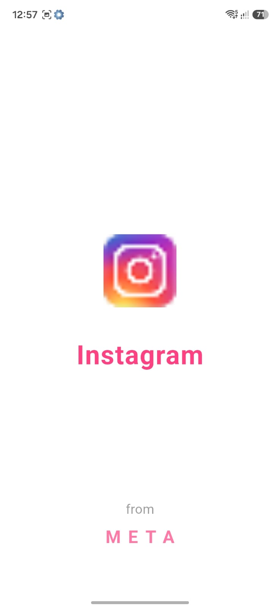
</p>

---

## 🤖 AI Content Generation

<p align="center">
  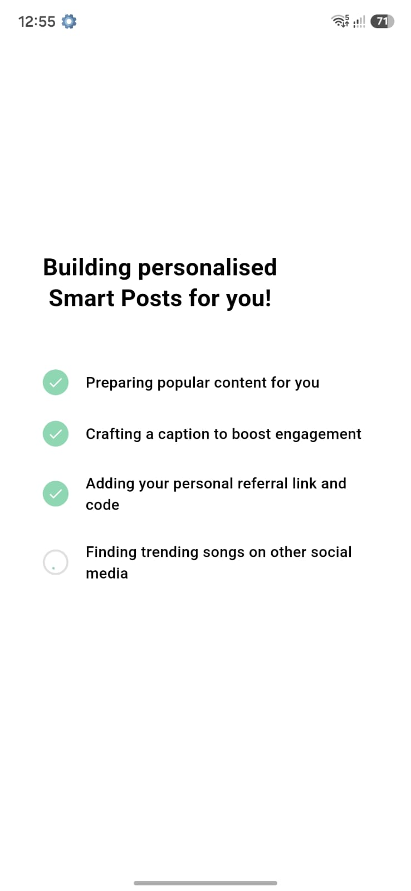
  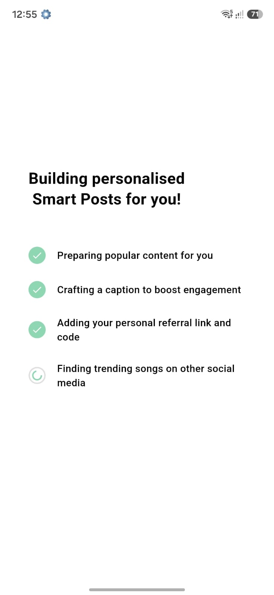
</p>

---

## 🏠 Home Feed

<p align="center">
  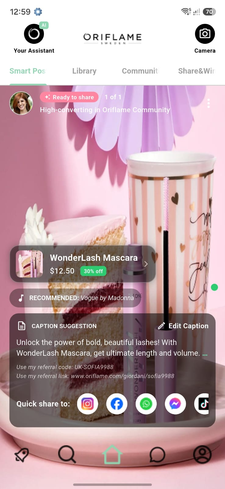
</p>

---

## 💄 Product Preview

<p align="center">
  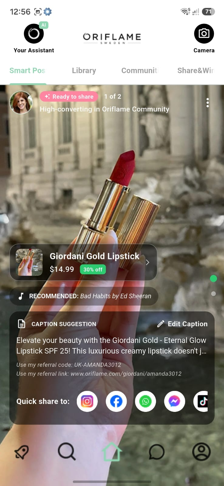
</p>

---

## 🛍️ Product Details

<p align="center">
  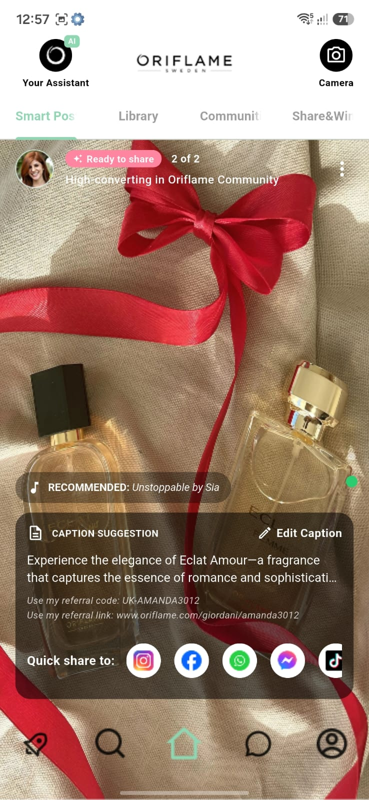
</p>

---

## 🔗 Store Redirect

<p align="center">
  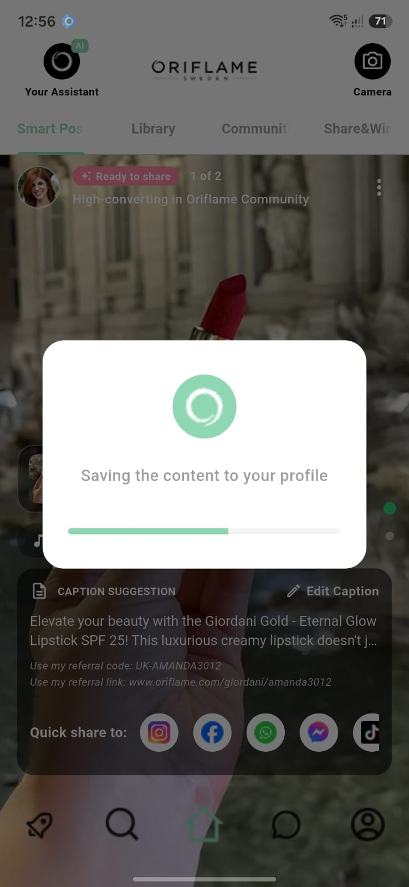
</p>

---

## ✏️ Edit Caption

<p align="center">
  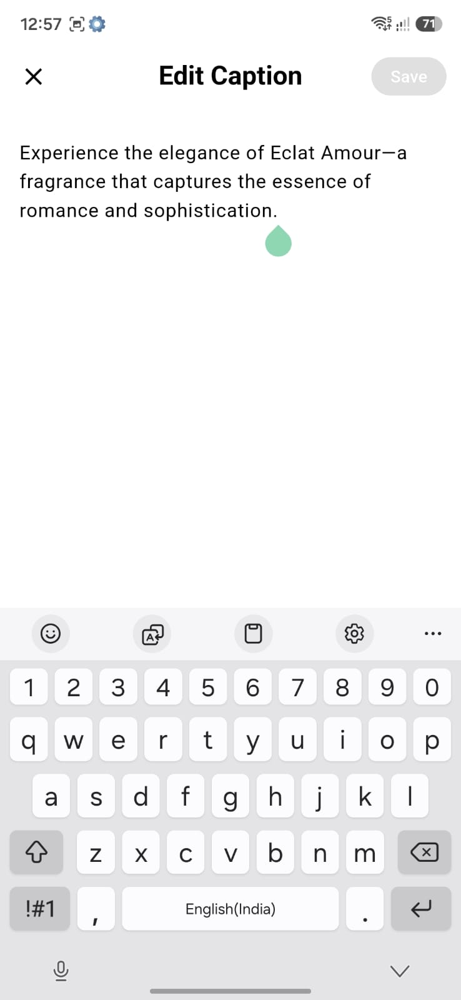
</p>

---

## ✅ Save Updated Caption

<p align="center">
  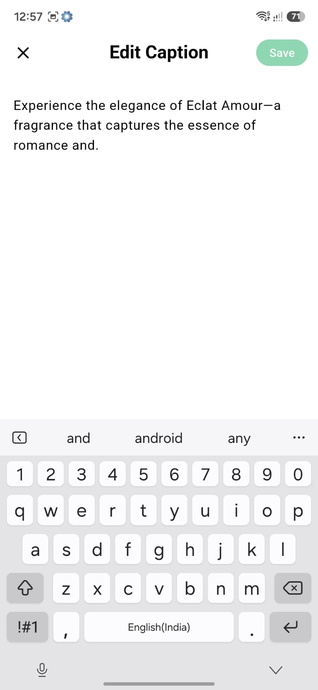
</p>

---

## 🔍 Search Screen

<p align="center">
  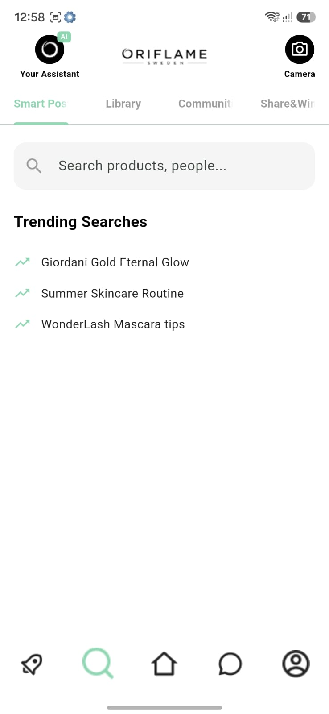
</p>

---

## 💬 Community Messages

<p align="center">
  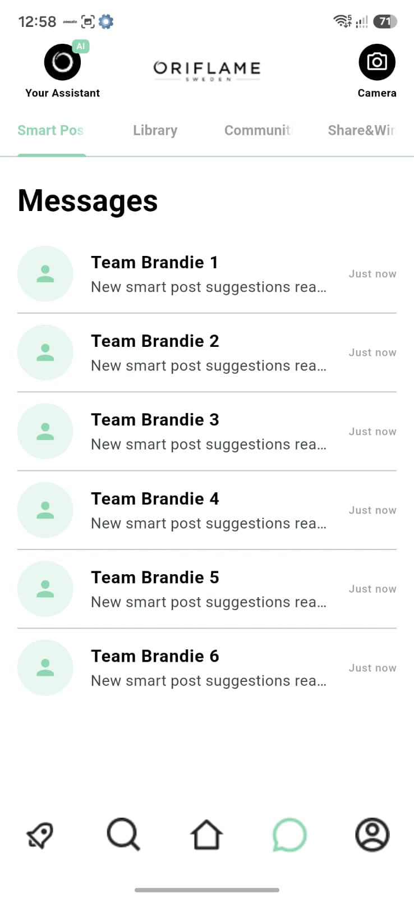
</p>

---

## 👤 User Profile

<p align="center">
  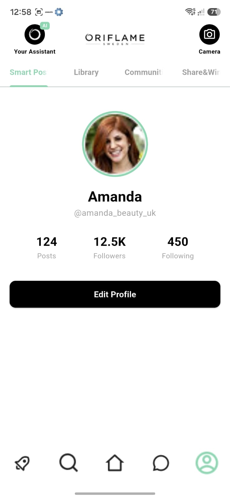
</p>

---

## 🚀 Rocket Page

<p align="center">
  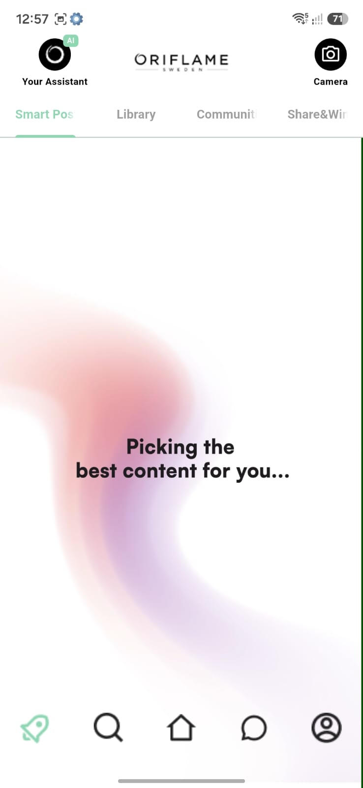
</p>

---

## ✨ Highlights

- Pixel-perfect implementation based on the provided Figma design.
- Clean Architecture with modular feature separation.
- Responsive UI for different screen sizes.
- Vertical and Horizontal PageView implementation.
- Auto-playing video support.
- Custom AI loading animations.
- Glassmorphism UI components.
- Interactive caption editor.
- Simulated social media sharing flow.
- Professional Flutter code structure and reusable widgets.

## 📌 Assumptions

- The application uses hardcoded data as requested in the assignment.
- No backend or API integration has been implemented.
- Social sharing screens are simulated for demonstration purposes.
- Video content is bundled locally for offline testing.

---

## 🎨 Design Implementation

The UI has been implemented by closely following the provided Figma design.

Special attention was given to:

- Pixel-perfect spacing and alignment
- Consistent typography
- Responsive layouts
- Smooth animations and transitions
- Reusable widget structure

---

## ✨ Additional Improvements

Beyond the assignment requirements, I also focused on:

- Modular folder architecture
- Reusable UI components
- Clean and readable code
- Responsive layouts
- Smooth transition animations
- Better code organization for future scalability

---

## 🚀 Future Improvements

Given additional development time, I would further enhance the project by adding:

- Dark Mode support
- Widget and unit tests
- Performance optimizations
- Accessibility improvements
- More polished micro-interactions and animations
- Complete localization support

---

Thank you for reviewing my assignment.

I appreciate your time and consideration.

**Mohammad Samir**
